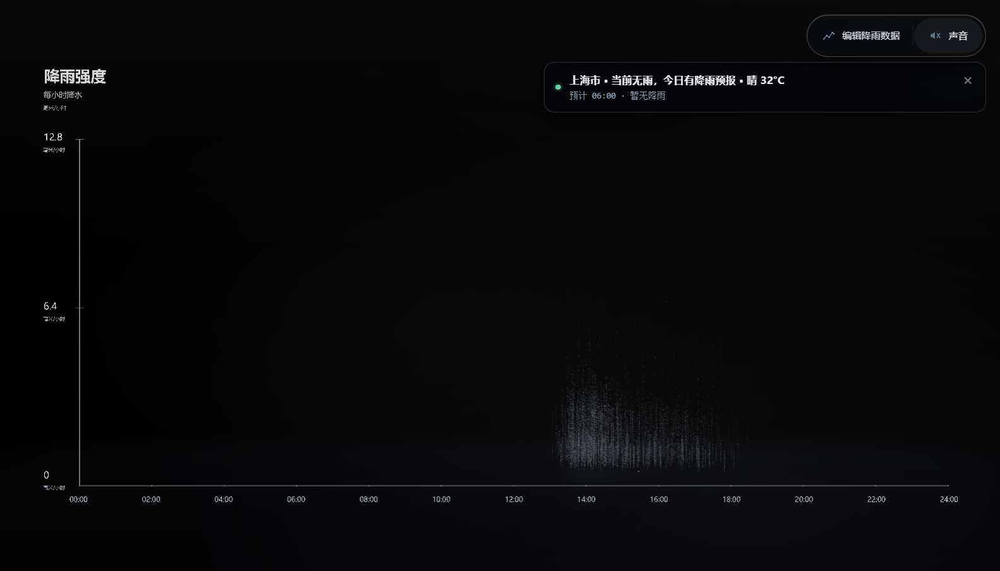

# Rainform Weather Desktop

[](https://github.com/OQ0603/Rainform-Weather-Desktop/releases/latest)
[](https://github.com/OQ0603/Rainform-Weather-Desktop/releases/latest)
[](LICENSE)

> 基于 [afterimage-lab/Rainform](https://github.com/afterimage-lab/Rainform) 制作的非官方、限非商业用途 Windows 桌面衍生版。

Rainform Weather Desktop 将真实城市天气转换成原版 Three.js/WebGL 雨景，保留粒子雨幕、峰值瀑布、水面波纹、坐标轴、拖动视角和雨声音效。软件资源全部打进桌面安装包，启动不依赖已部署网站。

An unofficial, noncommercial Windows desktop derivative that drives the original Rainform Three.js/WebGL landscape with live city weather.



## 下载

前往 [最新版本 Release](https://github.com/OQ0603/Rainform-Weather-Desktop/releases/latest)：

- `Rainform-Weather-Desktop-2.1.4-x64.exe`：Windows x64 NSIS 安装包，可选择安装目录，并创建桌面及开始菜单快捷方式。
- `Rainform-Weather-Desktop-2.1.4-x64-portable.zip`：解压后直接运行的便携版。
- `Rainform-Weather-Desktop-2.1.4-Test-Results.md`：构建、中国气象局实况、在线天气及桌面冒烟测试记录。

当前安装包未购买商业代码签名证书，Windows SmartScreen 可能显示“未知发布者”。请从本仓库 Release 下载并核对 Release 中公布的 SHA256。

## 功能

- 默认自动天气模式，启动时请求 Windows 定位并识别当前城市。
- 搜索城市、切换候选城市，以及重新定位恢复当前位置。
- 墨迹天气主进程适配；无凭据或请求失败时，国内优先切换中国气象局实况站，最终才回退 Open-Meteo。
- 国内无墨迹凭据时优先匹配最近的中国气象局实况站；后续雨势先服从中国气象局当天日间/夜间趋势，Open-Meteo只补齐小时刻度和温度。
- 当前降雨实测值、实况站、更新时间和暴雨预警会明确显示；预警强度可增强画面但不会伪造 mm/h。
- 自动面板将“当前监测实况”和“下一小时至 24:00 后续趋势”分开列出；气象局报大雨/中雨时，不再被 Open-Meteo 的毛毛雨结果降级。
- 将预报转换成 00:00–24:00 共 25 个降雨数据点。
- 自动与手动降雨模式可来回切换，手动编辑后雨幕和声音立即变化。
- 无雨时彻底停止雨幕、前景雨滴、瀑布、水花、粒子和雨声。
- 降雨强度真实影响雨幕密度、长度及声音增益。
- 独立天气状态栏、编辑面板、静音控制，以及桌面和横屏窗口防重叠布局。
- 网络失败时显示明确错误，同时保留手动模式。

## 天气凭据

软件使用阿里云云市场“墨迹天气（专业版经纬度）”接口。APPCode 与各接口 token 只由 Electron 主进程读取，不会通过 preload 暴露给渲染层：

```powershell
$env:MOJI_WEATHER_APPCODE='your-appcode'
$env:MOJI_WEATHER_CONDITION_TOKEN='your-condition-token'
$env:MOJI_WEATHER_FORECAST_TOKEN='your-forecast24hours-token'
pnpm start
```

旧环境变量仍兼容：`MOJI_WEATHER_PASSWORD` 作为 APPCode，`MOJI_WEATHER_TOKEN` 作为共享接口 token。墨迹不同接口通常使用不同 token，推荐使用上面的三个明确变量。

不要把真实凭据写入 `.env.example`、源码、GitHub Actions 或安装包。没有墨迹凭据时，国内坐标会明确显示最近的中国气象局实况站，并以气象局日间/夜间预报约束后续雨势；Open-Meteo只补全小时刻度和温度。墨迹实况成功而逐小时接口不可用时，也会保留墨迹实况并仅用 Open-Meteo 补全逐小时数据。

## 本地开发

需要 Node.js 20+ 和 pnpm 11。

```powershell
pnpm install --frozen-lockfile
pnpm run check
pnpm run test:integration
pnpm start
```

桌面冒烟测试：

```powershell
pnpm run test:cma-live
pnpm run test:desktop
```

打包后真实 Windows 系统定位验证（不注入测试坐标）：

```powershell
$env:RAINFORM_SYSTEM_LOCATION_EXECUTABLE='D:\path\to\Rainform Weather Desktop.exe'
pnpm run test:system-location
```

构建 Windows x64 NSIS 安装包：

```powershell
pnpm run dist:win
```

更多构建、安全边界与测试说明见 [docs/DESKTOP.md](docs/DESKTOP.md)，上游基线和衍生来源见 [docs/UPSTREAM.md](docs/UPSTREAM.md)。

## 项目结构

```text
electron/                  # Electron 主进程、安全 preload、天气服务
src/                       # Three.js 场景、天气控制器和界面样式
tests/                     # 天气服务与界面契约测试
scripts/electron-smoke.mjs # Playwright Electron 桌面冒烟测试
scripts/cma-live-smoke.mjs # 濮阳气象局实况和后续逐小时列表验证
scripts/system-location-smoke.mjs # 打包程序真实 Windows 定位验证
build/                     # Windows 图标
docs/                      # 桌面构建和原项目文档
```

## 验证摘要

2.1.4 发布前完成了以下实际验证：

- 项目检查、15 项单元/界面契约测试和 Vite 生产构建通过。
- 墨迹官方 APPCode/POST 经纬度请求契约通过模拟响应验证；大暴雨实况会覆盖当前小时的轻量 qpf 以驱动暴雨画面，但不会伪造实测 mm/h。
- 中国气象局濮阳站实时返回大雨和暴雨蓝色预警；气象局官方页面显示后续仍有连续降水，后续日间大雨/夜间中雨趋势不再被 Open-Meteo 毛毛雨降级。
- 中国气象局上海实况、气象局趋势约束、Open-Meteo小时刻度及“上海”城市搜索在线集成通过。
- 开发版 Electron 的 16 项桌面冒烟测试通过，包括监测实况后的逐小时列表、删除 Three.js 重复读数牌、普通悬停保持坐标轴与工具栏、实际拖动临时隐藏并在松开后恢复。
- 未注入测试坐标的打包程序 Windows 系统定位成功，识别为濮阳市并完成实况和后续趋势同步。
- 无雨时所有降雨粒子和声音增益为 0；小雨和大雨密度差异通过断言。
- 旧效果控制台、齿轮按钮和旧本地调参读取已从源码删除。
- NSIS 安装包和便携 ZIP 的归档完整性检查通过。

完整证据随 GitHub Release 一同提供。

## 许可与上游声明

本仓库公开源码，但使用 [PolyForm Noncommercial License 1.0.0](LICENSE)，**不是 OSI 批准的开源许可证，仅允许非商业用途**。商业使用、商业产品集成、广告和品牌项目不在授权范围内。

所有复制品和衍生作品必须保留许可证、[NOTICE.md](NOTICE.md) 和以下 Required Notice：

```text
Required Notice: Rainform / 数据成雨 © 2026 afterimage — https://rainform.pages.dev/
```

Rainform 名称、Logo 和官方视觉标识属于原项目；本仓库不是 afterimage-lab 官方发布。详见 [TRADEMARKS.md](TRADEMARKS.md) 和 [COMMERCIAL_USE.md](COMMERCIAL_USE.md)。

本项目只发布 Windows 桌面版源码和安装包，没有部署或更新原 Rainform 网站。
